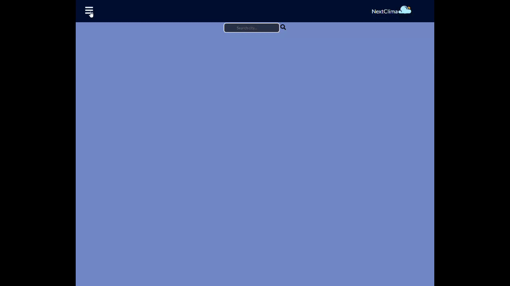
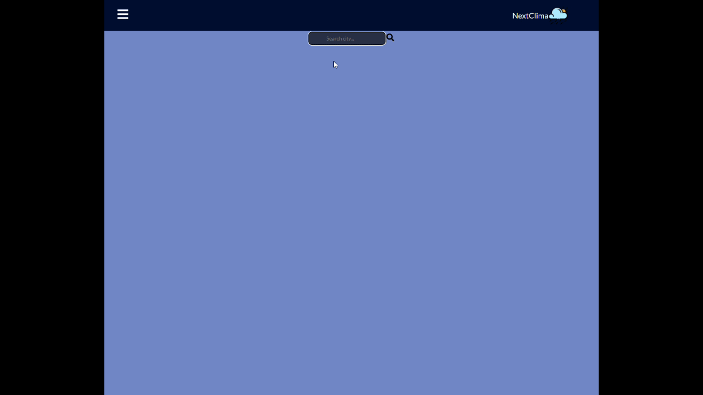
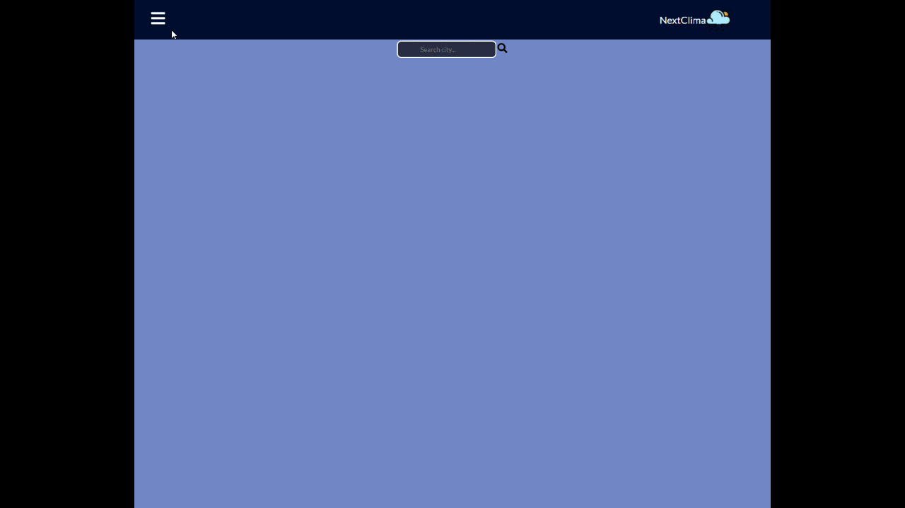

# NextClima

NextClima is an application in which you can see the climate of your city or your country

<h2>Start</h2>
At the beginning you will find a side bar which when you click on it will open to the right side. You will also find a search engine in which you can search for your city or country

 

When doing a search of your city or country you can see more details of it by clicking on its name
<h2>Searching </h2>

and to finish in the NavBar you will find 3 options, one of them is home, the other option is an aboutme in which you can see my information to contact me etc. and finally the option to download CV, when you press there you will download my CV instantly
<h2>About Me and CV download </h2>

 

